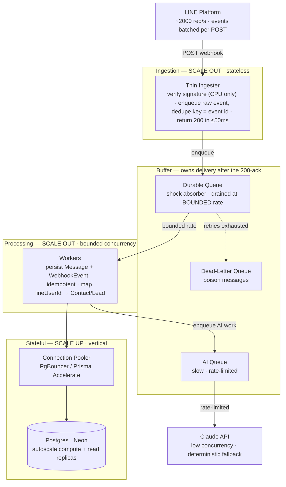

# 05 · Infrastructure & Deployment

Deployment, environments, observability, and the production scaling design. Stack rationale → [03_Architecture](03_Architecture.md).

---

## 1. Deployment

- **App:** Vercel (project `jenosize-ai-crm`) → live at **https://jenosize-ai-crm.vercel.app**. Single `git push` / `vercel --prod` deploy (builds from local, not git).
- **Database:** Neon Postgres (ap-southeast-1). Prisma uses a **pooled** `DATABASE_URL` for the app and a **direct** `DIRECT_URL` for migrations. Migrations applied via `prisma migrate deploy`; seeded to scenario scale.
- **Local dev:** Docker Compose Postgres (`pnpm db:up`); the app defaults to local Docker unless prod env is explicitly loaded.

## 2. Environments & secrets

- Secrets live in gitignored `.env*` and the Vercel dashboard; `.env.example` carries placeholders. **No secrets committed.**
- Key vars: `DATABASE_URL` / `DIRECT_URL`, `AUTH_SECRET` (session JWT + signed link tokens), `ANTHROPIC_API_KEY` (+ optional `CRM_AI_MODEL`), `LINE_ENABLED`, `LINE_CHANNEL_ACCESS_TOKEN`, `LINE_CHANNEL_SECRET`, `LINE_LIFF_ID`, `LINE_LOGIN_CHANNEL_ID`, and the email/SMTP vars (see `docs/EMAIL_INTEGRATION.md`).
- **Prod↔local are separate databases** (Neon vs Docker) — data linked/toggled in one does not appear in the other.

## 3. Two ways to reach the LINE webhook

The app is env-driven, so the *same* code serves both. Only one webhook URL can be registered in the LINE console at a time — switch as needed.

| Environment | Webhook URL | Use when | Notes |
|---|---|---|---|
| **Production (Vercel)** | `https://jenosize-ai-crm.vercel.app/api/line/webhook` | The demo / submission | **Stable, permanent.** Set once → Verify. Prod has `LINE_ENABLED=true` + live creds; DB is Neon. |
| **Local dev (tunnel)** | `https://<random>.trycloudflare.com/api/line/webhook` | Iterating on webhook code without redeploying | `pnpm dev` + `pnpm tunnel` (Cloudflare quick tunnel). **Ephemeral** — the subdomain changes each run, so re-paste it into the console. DB is local Docker. |

## 4. Observability

Lightweight JSON app logger + DB audit rows (`WebhookEvent`, `Activity`, failure Activities). Metrics/alerts worth wiring in production: queue depth, consumer lag, DLQ size, DB pool utilization, ingester p99.

---

## 5. Scaling to 1,000–2,000 req/s (production design — **not built in the MVP**)

> **Scope note.** A *design + roadmap*, deliberately out of MVP scope — building it into a synthetic-data MVP would be over-engineering. **Honest read on the number:** a LINE OA rarely generates 1–2k *request*/s — **LINE batches multiple events into a single webhook POST**, so even a large account produces far fewer requests than events. The right answer is "here's how I'd scale it, *and* why we likely never hit that rate."

### 5.1 Core principle — the webhook never touches Postgres or Claude directly

The MVP does signature-verify → DB persist → (later) AI in the request path; that doesn't survive a spike. Production splits ingestion from processing so bursty traffic hits a **buffer**, not the DB:

### 5.2 The real bottleneck is the database, not the webhook

The ingester is stateless + CPU-only (HMAC) — scales out trivially. The wall is **Postgres connection exhaustion**: serverless + Prisma opens connections per instance. Fixes, in order:
- **Connection pooler is mandatory** — Neon's PgBouncer / Prisma Accelerate / serverless HTTP driver; connect via the pooled URL with a small `connection_limit`. Single change that prevents "server down."
- **Idempotency in one round trip** — `INSERT ... ON CONFLICT (providerEventId) DO NOTHING` (DB unique constraints are the dedupe).
- **Bounded worker concurrency** converts a bursty 2,000 rps into a steady write rate; backpressure absorbed by queue depth, not the DB.
- **Scale up** the stateful piece: Neon autoscaling compute + read replicas for CRM reads.

### 5.3 Queue choice

**Default: Upstash QStash** — HTTP push queue, Vercel-native, with retries, per-endpoint rate-limiting, and a DLQ (its throttle *is* the bounded-concurrency control). *Alternative* off-Vercel: SQS or Pub/Sub → containerized consumers. **Delivery handoff:** the instant the ingester returns `200`, LINE stops retrying — delivery is now the queue's, so it must be **durable** with a **dead-letter path**.

### 5.4 Auto-scale mechanics

| Component | Lever | Mechanism |
|---|---|---|
| Ingester | Scale out | Vercel functions auto-scale on concurrency; Fluid Compute for in-instance concurrency + lower cold-start tail |
| Workers | Scale out | QStash throttle caps rate; self-hosted → Cloud Run or K8s HPA/KEDA on queue depth |
| Postgres | Scale up | Neon autoscaling compute + pooler; read replicas |
| AI/Claude | Rate-limit, not scale | Separate slow queue, low concurrency, retry w/ jitter, honor RPM/TPM; deterministic fallback means the path never hard-fails |

### 5.5 Backpressure & safety signals

- **Metrics:** queue depth, consumer lag, DLQ size, DB pool utilization, ingester p99.
- **Alerts:** lag growth (workers behind), DLQ non-empty (poison), pool near saturation.
- **Load-shed:** return 200 only when the event is durably accepted; otherwise 5xx and let LINE retry (its retry is the backpressure of last resort).
