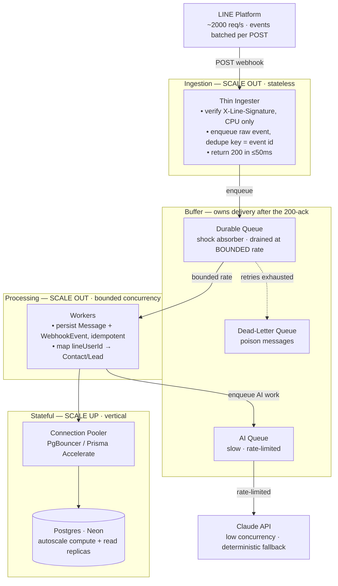

# AI CRM MVP — Implementation Plan

**Assignment:** Jenosize — Lead AI Software Engineer test
**Deliverable:** Working AI CRM MVP (website + API + DB + reusable AI skill + LINE OA integration)
**Timebox:** 5 working days · **≤16 focused hours** · synthetic data only
**Grading:** Part 1 Product (50%) · Part 2 AI Skill + LINE (30%) · Part 3 Evidence + Handover (20%)

> Guiding principle from the brief: they want a **coherent vertical slice** with **sound trade-offs, readable code, and evidence that AI tools were used with human review** — *not* feature-completeness. Every scope decision below optimizes the score-per-hour against that rubric.

---

## 1. Chosen Stack & Why (defend this in the walkthrough)

| Layer | Choice | One-line justification |
|---|---|---|
| Frontend | **Next.js (App Router) + React + Tailwind** | One app, one deploy target; server components keep it fast under a tight timebox |
| API | **Next.js Route Handlers** (`/app/api/*`) | No separate service to wire/deploy; still a real REST surface |
| Validation | **Zod** | Shared request/response schemas; satisfies "validation" requirement cheaply |
| ORM / DB | **Prisma + PostgreSQL (Neon serverless)** | Real migrations, constraints, relations; persistence survives restart (rubric-critical) |
| Auth | **Credentials + seeded demo users** (Auth.js/NextAuth or a thin JWT) | "login or documented demo auth" — keep it simple, document it |
| AI | **Anthropic Claude** — `claude-haiku-4-5` default (cost), `claude-sonnet-5` swappable | Structured JSON output for score/summary/next-action; clean fallback wiring |
| LINE | **LINE Messaging API** (webhook + reply/push) | Signature verify + mock adapter for local tests |
| Tests | **Vitest** (unit/integration) + optional **Playwright** (one E2E) | Covers the 3 required test flows without over-investing |
| Deploy | **Vercel** (app) + **Neon** (DB) | Free tier, single `git push` deploy, public demo URL |
| Observability | Lightweight JSON logger + DB audit rows | Satisfies "structured logging + monitoring notes" without adding dependency/deploy risk |

**Trade-off headline for the interview:** chose a single Next.js full-stack app over a split FE/BE to spend the 16h budget on *product depth and the AI/LINE safety boundary*, not on plumbing two deploy targets. Documented as an explicit trade-off in the README.

---

## 2. Architecture (target)

```
Browser (CRM UI)
   │  fetch (Zod-typed)
   ▼
Next.js Route Handlers ──► Prisma ──► PostgreSQL (Neon)
   │                                    ▲
   │                                    │ persist events / suggestions / audit
   ├─► crm-copilot skill ──► Claude API ─┘   (fallback: deterministic scorer)
   │        (returns SUGGESTIONS only)
   │
   └─► /api/line/webhook ◄── LINE Platform
            • verify X-Line-Signature (HMAC-SHA256)
            • idempotency on event/message id
            • persist inbound Message + map LINE user → Contact/Lead
            • outbound reply requires human approval (draft → approved → sent)
            • mock adapter when LINE_ENABLED=false
```

**The one boundary that wins Part 2:** AI output and inbound LINE events are **suggestions/records**, never silent side effects. Nothing goes to the customer or becomes a confirmed CRM fact until a human approves it. That boundary is the audit trail.

---

## 3. Data Model (Prisma schema, 8 tables)

```
User            id, name, email(unique), role, passwordHash, createdAt
Company         id, name, industry, size, website, notes, createdAt
Contact         id, companyId→Company, name, email, phone, title,
                lineUserId(unique, nullable)         # LINE→CRM mapping key
Lead            id, title, companyId→Company, contactId→Contact,
                ownerId→User, stage(enum), source(enum), valueTHB,
                score(int, nullable), scoreReason(text, nullable),
                createdAt, updatedAt
Activity        id, leadId→Lead, userId→User, type(enum), body,
                metadata(json), createdAt              # immutable timeline
Message         id, leadId→Lead(nullable), contactId→Contact,
                channel(enum=LINE), direction(enum IN/OUT),
                providerMessageId(unique, nullable),   # idempotency
                status(enum RECEIVED/DRAFT/APPROVED/SENT/FAILED),
                body, createdAt
AiSuggestion    id, leadId→Lead, type(enum SUMMARY/SCORE/NEXT_ACTION/LINE_DRAFT),
                payload(json), model, status(enum SUGGESTED/ACCEPTED/REJECTED),
                createdBy, createdAt                    # AI ≠ confirmed write
WebhookEvent    id, provider, providerEventId(unique), signatureValid(bool),
                rawPayload(json), status, processedAt   # dedupe + audit
```

**Enums:** `Stage = NEW|QUALIFIED|PROPOSAL|WON|LOST` · `Source = WEBSITE|MANUAL|LINE_OA` · `ActivityType = NOTE|CALL|EMAIL|STAGE_CHANGE|AI_SUGGESTION|LINE_IN|LINE_OUT`.

**Constraints that show intent:** unique `Contact.lineUserId`, unique `Message.providerMessageId` (idempotency at the DB layer), unique `WebhookEvent.providerEventId`, FK cascades chosen deliberately, `Stage`/`Source` as enums not free strings.

**Seed:** ~20 users, ~150 companies, **~2,000 contacts, ~300 leads** across all stages (matches the scenario's stated scale — 20-person team, 2,000 contacts, 300 active leads), activities + a few LINE messages. Seeding to scenario scale is near-free with faker and is what makes **search/filter + pagination** demonstrate real value rather than looking trivial on 200 rows. Deterministic seed (fixed faker seed) so the demo is reproducible; bulk-insert in batches so seeding stays fast.

---

## 4. Scope per Part → Definition of Done

> **Progress:** Auth, data model + seed, Leads/Companies/Contacts management, Lead detail, pipeline board, AI copilot/fallback, and the full LINE webhook/outbound flow are done. **Deployed to Vercel + Neon (live, smoke-tested)** and **pushed to GitHub.** Remaining submission evidence: LINE OA QR + 3–5 min walkthrough video + a real outbound-send screenshot (and making the repo public).

### Part 1 — Working Product (50%) · *Result-Oriented + Ownership*
- [x] Auth: login page + seeded demo creds (thin jose session; guards on pages + API). *(Block 2)*
- [x] List views with **search + filter**: Leads, Companies, and Contacts done with pagination and Zod-backed create/edit flows.
- [x] **Pipeline board**: native drag/drop board plus lead-detail stage mover; both reuse the atomic stage-move service and write `STAGE_CHANGE` Activity.
- [x] **Lead detail page**: profile + unified **timeline** (activities + messages, chronological). *(Block 3)*
- [x] CRUD, all inputs Zod-validated: companies/contacts create/edit done; lead stage changes validated through shared service.
- [x] **Deployed** to Vercel + Neon; **persistence verified across restart/refresh** (no in-memory state) — live at https://jenosize-ai-crm.vercel.app, smoke test 11/11.
- **DoD:** a stranger can log in at the demo URL, find a lead, move its stage, and see the timeline update — after a hard refresh.

### Part 2 — AI Skill + LINE OA (30%) · *Growth/Agile + Entrepreneurial*
- [x] `skills/crm-copilot/SKILL.md`: purpose, inputs, outputs, **allowed actions, guardrails, failure behavior, ≥5 eval cases** (10) — verified + mapped to the MVP data model.
- [x] Copilot endpoint builds CRM context → returns structured JSON, written to `AiSuggestion` (status `SUGGESTED`). Model path supports draft LINE replies when there is LINE context and consent permits it; no-credit Anthropic account currently exercises fallback.
- [x] UI: "Generate suggestion" on lead detail → shows suggestion → **Accept/Reject**. Suggestions with LINE drafts save a `Message(DRAFT)`; sending still requires a separate approval click.
- [x] **Deterministic fallback** when Claude is down (rule-based score from stage/recency/source, no fabricated model prose) — clearly labeled as fallback.
- [x] LINE webhook: **verify X-Line-Signature** against raw body before parse, capture inbound text messages, **map LINE user → Contact/Lead**, persist `Message` + `WebhookEvent`, **idempotent** on `webhookEventId` / `providerMessageId`.
- [x] Outbound reply = **approval-based draft** (`DRAFT → APPROVED → SENT|FAILED`); mock adapter for local tests and dev, real push-message adapter with `X-Line-Retry-Key` when `LINE_ENABLED=true`; **no secrets committed**.
- **DoD:** local route tests prove invalid signature rejection and replay idempotency. **Inbound proven end-to-end with a real device** via a Cloudflare quick tunnel (`pnpm tunnel`): real LINE messages hit the webhook with a valid signature, mapped to a Contact/Lead, and logged as `LINE_IN` Activities. Real outbound phone send is unblocked locally (`LINE_ENABLED=true`, tunnel HTTPS, live channel creds); the deployed HTTPS URL is only needed for a permanent (non-ephemeral) webhook.

### Part 3 — Evidence + Handover (20%) · *Win Together + Leave Legacy*
- [x] **README**: architecture, DB config, setup/run/test, demo creds, API notes, LINE setup, and monitoring notes done. Deployed URL live (https://jenosize-ai-crm.vercel.app); LINE QR pending (submission-package item, tracked in §11 / SUBMISSION_CHECKLIST).
- [x] **Architecture + data-flow diagram** (Mermaid in README + standalone `docs/architecture.html`).
- [x] API notes, `.env.example`, key trade-offs, known limitations, production next steps — API notes + `.env.example` + scaling notes + LINE event mapping/backfill helpers + predeploy check + deploy/submission audit scripts + submission checklist done; **deployed URL live**. (LINE QR still pending as a submission-package item.)
- [x] **3 automated tests** (Vitest): **(1) core CRM flow — create lead→move stage→activity logged**, **(2) AI skill fallback**, and **(3) LINE webhook invalid-signature + replay idempotency** are done. Added outbound draft approval, greeting auto-reply, LIFF register/verify, Tasks, LINE follow/unfollow, P1 deal/assignment, email gateway, and inbound-email coverage too. Latest full run: `99 passed` (18 files, typecheck clean).
- [x] Structured logging + monitoring notes: JSON app logger + MVP audit rows + failure Activities done; README monitoring notes done.
- [x] **AI-usage log**: sample prompts/tasks, what you reviewed/rejected, **one meaningful change after human inspection** documented in `docs/AI_USAGE_LOG.md`.
- [~] Submission: repo + deployed URL + demo creds + LINE QR + **3–5 min walkthrough video** — **repo pushed** (github.com/KOLAAAAA1/jenosize-ai-crm, make public before submitting), **deployed URL + demo creds live**, walkthrough script/checklist done; **LINE QR + walkthrough video + real outbound-send screenshot still pending.**
- **DoD:** another engineer clones, runs `pnpm i && setup && dev`, and is productive in <15 min.

---

## 5. 16-Hour Schedule (mapped to rubric weight)

Status: ✅ done · ◐ partial · ▫ pending

| Block | Status | Hrs | Work | Rubric |
|---|---|---|---|---|
| 0 | ✅ | 1.0 | Repo init, Next.js + Tailwind + Prisma (local Docker + Neon-ready), `.env.example` **done**. **Deployed** to Vercel (project `jenosize-ai-crm`) + **Neon** Postgres (ap-southeast-1): 4 migrations applied via `DIRECT_URL`, seeded 2000 contacts/300 leads, 11 prod env vars pushed with `LINE_ENABLED=true` → live at **https://jenosize-ai-crm.vercel.app** | P1 |
| 1 | ✅ | 1.5 | Prisma schema + migrations + deterministic seed (scenario scale); persistence verified | P1 |
| 2 | ✅ | 1.0 | Auth (jose session) + seeded demo login; guards on pages + API | P1 |
| 3 | ✅ | 2.5 | Leads list **done**; Companies + Contacts lists (search/filter/pagination) + create/edit CRUD (Zod) **done**; `Contact.consentStatus` enum added (migration `add_contact_consent`); seed switched to `fakerTH` (Thai names/phones) | P1 |
| 4 | ✅ | 2.0 | Lead detail + timeline **done**; stage-move Activity **done**; drag pipeline board **done** (`useOptimistic` + native DnD, reuses `applyStageMove`) | P1 |
| 5 | ✅ | 0.5 | Deploy checkpoint #2 **done** — live smoke test (`scripts/smoke-deploy.mjs`) against the deployed URL: **11/11 PASS** (login → session → leads/board → unsigned webhook 401-reject → logout), proving Neon persistence end-to-end | P1 |
| 6 | ✅ | 1.5 | `crm-copilot/SKILL.md` **done**; Claude client (`@anthropic-ai/sdk`, opus-4-8, structured output) + **deterministic fallback** **done** (`src/lib/ai/*`, injectable `callModel` seam); AI-fallback required test filled | P2 |
| 7 | ✅ | 1.0 | `AiSuggestion` flow **done**: `/api/ai/copilot` persists SUGGESTED → CopilotPanel (Generate + Accept/Reject); LINE draft suggestions save `Message(DRAFT)` only after explicit click | P2 |
| 8 | ✅ | 2.0 | LINE webhook done: raw-body signature verify, invalid-signature audit, event/message idempotency, contact/lead mapping, inbound `Message(RECEIVED)` + `LINE_IN` Activity; route-level tests pass | P2 |
| 9 | ◐ | 1.0 | Outbound approval flow done locally: AI draft → `Message(DRAFT)` → human approve/send → mock or real LINE push adapter with `X-Line-Retry-Key`. **Inbound now proven with a real device** via Cloudflare tunnel (signature-valid webhook → Contact/Lead mapping → `LINE_IN` Activity). Real outbound phone send unblocked locally (`LINE_ENABLED=true`, tunnel HTTPS, live creds) — evidence capture pending | P2 |
| 10 | ✅ | 1.0 | Vitest set up; required tests done (CRM flow, AI fallback, LINE security/idempotency) plus outbound approval, unmapped-webhook backfill, greeting auto-reply, LIFF register/verify, Tasks, LINE follow/unfollow, P1 deal/assignment, and email coverage. Latest full run: **18 files / 99 tests passed** | P3 |
| 11 | ◐ | 1.0 | Architecture diagram + `.env.example` + DB-config + README setup/API/LINE/monitoring notes + AI-usage log + LINE mapping/backfill helpers + predeploy check + deploy/submission audit scripts + submission checklist + walkthrough script **done**; **deployed URL live** (https://jenosize-ai-crm.vercel.app · demo `admin@jenosize.demo` / `Demo1234!`); LINE QR + 3–5 min walkthrough video pending | P3 |
| — | — | — | *(Video recorded after, outside the 16h coding budget)* | P3 |

**Buffer strategy:** blocks 0–5 (Part 1, 8.5h) are the floor — if time runs out, a deployed CRM alone is a passing submission. Parts 2 and 3 are additive slices, each independently shippable.

**Two ways to reach the LINE webhook** — the app is env-driven, so the *same* code serves both:

| Environment | Webhook URL | Use when | Notes |
|---|---|---|---|
| **Production (Vercel)** | `https://jenosize-ai-crm.vercel.app/api/line/webhook` | The demo / submission | **Stable, permanent.** Set once in the LINE console → Verify. Prod env has `LINE_ENABLED=true` + live creds; DB is Neon. |
| **Local dev (tunnel)** | `https://<random>.trycloudflare.com/api/line/webhook` | Iterating on webhook code without redeploying | `pnpm dev` + `pnpm tunnel` (Cloudflare quick tunnel). **Ephemeral — the subdomain changes every run**, so re-paste it into the LINE console each session. DB is local Docker. |

Only one webhook URL can be registered in the LINE console at a time, so switch it between the Vercel URL (demo) and the current tunnel URL (local dev) as needed. Prod (Neon) and local (Docker) are separate databases — data linked/toggled in one does not appear in the other.

---

## 6. Security & Judgment Checklist (the "AI-native but not AI-blind" signal)

- Verify LINE signature **before** parsing body; reject on mismatch (401) — test covers it.
- Secrets only in env / Vercel dashboard; `.env.example` has placeholders; secret scanning before commit.
- AI never writes a confirmed record or sends a message without human approval.
- All AI-generated code reviewed before merge (documented in AI-usage log — this is literally graded).
- Idempotency + retry on LINE so provider re-delivery can't double-send or double-persist.
- Input validation at every API boundary (Zod); DB constraints as the second line of defense.
- Rate-limit / timeout the LLM call; fallback path always available so the demo never hard-fails.

---

## 7. Top Risks & Mitigations

| Risk | Mitigation |
|---|---|
| LINE OA setup friction (verified webhook URL needs public HTTPS) | Deploy to Vercel day 1 so webhook URL is stable; mock adapter for local dev |
| LLM latency/cost/flakiness in demo | Haiku 4.5 + strict `max_tokens` + timeout + deterministic fallback |
| Over-scoping Part 1 CRUD | Companies/Contacts get minimal CRUD; **Leads** get the depth (that's where the rubric is) |
| Persistence "gotcha" (in-memory) | Neon Postgres from hour 1; explicit restart test in the video |
| Time overrun | Part 1 is the floor; 2 & 3 layered so a partial submission is still coherent |

---

## 8. Interview-Ready Talking Points (prep for the walkthrough video)

1. Why one Next.js app over split services — a *delivery* trade-off under a 16h budget.
2. The suggestion↔commit boundary and why it's the audit trail (separates AI from truth).
3. Idempotency + signature verification as the two things that make a webhook production-safe.
4. Where I used the AI agent, what I **rejected**, and the one change I made after review.
5. What I'd do next for production (real auth/RBAC, queue for outbound, eval harness in CI, PII handling for LINE data).

---

## 9. Open Assumptions (documented, not blocking — per the brief's anti-red-flag guidance)

- "Demo auth" = seeded credentials over HTTPS. Basic role enforcement is now shipped (admin/manager shared access; sales limited to owned leads/tasks); SSO, user lifecycle management, and richer permission configuration remain production next steps.
- Single LINE OA channel; one-to-one LINE user ↔ Contact mapping via `lineUserId`.
- Synthetic data only; no real PII. Seed matches the scenario's stated scale (~2,000 contacts, ~300 leads) so list/search/filter/pagination are exercised realistically; this is demo/synthetic scale, not a live-load or throughput target.
- "Reusable AI skill" = a documented `SKILL.md` contract + a provider-agnostic call site, so it can be lifted into other Jenosize projects.

---

## 9.1 Clarifying Questions I'd Raise with Stakeholders

The brief is deliberately open ("choose any suitable stack", "document assumptions"), and treating vague requirements as a blocker is an explicit red flag. So the default move is **assume and proceed**; the list below separates what I *assumed and built on* from the few points I would genuinely **confirm with a BA / SA / HR** in a real engagement. Documenting these is itself the requirement-discovery + stakeholder-communication signal the rubric grades — not a request for perfect specs.

### Business rules — would confirm with BA / SA (these change domain logic)

- **Lead scoring:** Is there an existing qualification rubric, or is the model free to define one? What factors and weights (budget / authority / need / timeline)? *MVP: heuristic score from stage/recency/source, clearly labeled — swappable for a real rubric.*
- **Stage criteria & SLA:** Entry/exit criteria and any time-in-stage SLA for New → Qualified → Proposal → Won / Lost? *MVP: stages are free transitions with an audit Activity on each move.*
- **PDPA / consent:** Is opt-in required before any LINE outbound, and how is consent evidence stored? *MVP: `Contact.consentStatus`; outbound refuses `OPTED_OUT`. The **policy** (when a send is lawful) is a business/legal decision.*
- **Dedup / merge:** When the same person arrives from website + manual entry + LINE, what is the match key (email / phone / `lineUserId`) and merge behavior? *MVP: assumes 1:1 LINE-user↔Contact; no auto-merge.*
- **Lead assignment:** How are leads distributed across the 20-person team — round-robin, territory, or manual? *MVP: explicit `owner`; no auto-routing.*
- **Output language:** Should AI summaries / LINE replies be Thai, English, or match the customer's language? *MVP: follows input; prompt is language-agnostic.*

### Technical / NFR — assumed and documented (would confirm, not blocking)

- **Auth/SSO & RBAC:** Real Google Workspace / Azure AD SSO and role tiers (admin / manager / sales)? → assumed seeded demo auth; SSO is a production next step.
- **Hosting & data residency:** Mandated cloud or Thailand data-residency requirement? → assumed Vercel + managed Postgres (Neon).
- **Website intake mechanism:** How do website leads actually arrive (form POST / webhook / API)? → assumed a standard ingestion endpoint.
- **LINE plan & features:** OA plan tier / rate limits; any Rich Menu or LIFF needs? → assumed basic Messaging API.
- **Observability & secrets:** Standard monitoring stack (Sentry / Datadog) and secrets manager? → JSON logging + env-based secrets in MVP; noted in production next steps.

### Logistics — would confirm with HR

- How long must the deployed demo URL stay live after submission (hosting-cost implication)?
- Walkthrough video language (Thai / English) and audience (technical panel or not)?
- Required repo host / visibility and who to grant access to.
- Is the 16-hour budget a hard cap or a guideline — are documented trade-offs on an incomplete slice penalized?

---

## 10. Scaling to 1,000–2,000 req/s (production design — **not built in the 16h MVP**)

> **Scope note & judgment call.** This section is a *design + roadmap*, deliberately **out of MVP scope**. Building it into a synthetic-data MVP would be over-engineering and cut against the rubric's "sound trade-offs, not feature-completeness." It's here as the graded "production next steps" answer and a walkthrough talking point.
>
> **Honest read on the number:** a LINE OA rarely generates 1–2k *request*/s — **LINE batches multiple events into a single webhook POST**, so even a large account produces far fewer requests than events. The right engineering answer is "here's how I'd scale it, *and* here's why we likely never hit that rate" — not silently building for a number that won't occur.

### 10.1 Core principle — the webhook never touches Postgres or Claude directly
The MVP does signature-verify → DB persist → (later) AI, all in the request path. That does **not** survive a spike. The production shape splits ingestion from processing so bursty traffic hits a **buffer**, not the database:



### 10.2 The real bottleneck is the database, not the webhook
The ingester is stateless and CPU-only (HMAC) — it scales out trivially. The wall is **Postgres connection exhaustion**: serverless + Prisma opens connections *per instance*, so 2,000 concurrent invocations blow past Neon's connection limit almost immediately. Fixes, in order of importance:
- **Connection pooler is mandatory** — Neon's built-in PgBouncer pooler (or Prisma Accelerate, or the serverless HTTP driver). Prisma connects via the **pooled** URL with a small `connection_limit`. This is the single change that prevents "server down."
- **Idempotency in one round trip** — `INSERT ... ON CONFLICT (providerEventId) DO NOTHING` instead of read-then-write; the DB unique constraints (already in §3) are the dedupe.
- **Bounded worker concurrency** converts a bursty 2,000 rps into a steady, sustainable write rate (e.g. cap at ~200 rps) — backpressure absorbed by queue depth, not by the DB falling over.
- **Scale up** the stateful piece: Neon autoscaling compute + read replicas for the CRM read paths. This is the "scale up" half — the DB is the component you can't just replicate away.

### 10.3 Queue choice (one default, defended)
**Default: Upstash QStash** — HTTP push queue, Vercel-native (no long-lived worker to host), with built-in **retries, per-endpoint rate-limiting/throttling, and a DLQ**. Its throttle *is* the bounded-concurrency control. *Alternative* if workers move off Vercel: **SQS or Google Pub/Sub** feeding containerized consumers.

**Delivery-guarantee handoff (critical):** the instant the ingester returns `200`, **LINE stops retrying** — delivery is now owned by the queue. This is why the queue must be **durable** and have a **dead-letter path** for poison messages, not just be an in-memory buffer. Lose the queue = lose the events.

### 10.4 Auto-scale mechanics (scale out + scale up)
| Component | Lever | Mechanism |
|---|---|---|
| Ingester | **Scale out** | Vercel functions auto-scale on concurrency; enable **Fluid Compute** for in-instance concurrency + lower cold-start tail latency |
| Workers | **Scale out** | QStash throttle caps rate; if self-hosted → Cloud Run (scale on concurrency) or K8s **HPA/KEDA scaling on queue depth** |
| Postgres | **Scale up** | Neon autoscaling compute + pooler; read replicas for reads |
| AI/Claude | **Rate-limit, not scale** | Separate slow queue, low concurrency, retry w/ jitter, honor Anthropic RPM/TPM; deterministic fallback (§4) means the path never hard-fails. AI is async + human-gated, so it's off the hot path by design |

### 10.5 Backpressure & safety signals
- **Metrics:** queue depth, consumer lag, DLQ size, DB pool utilization, ingester p99.
- **Alerts:** lag growth (workers falling behind), DLQ non-empty (poison messages), pool near saturation.
- **Load-shed:** if the queue itself is degraded, the ingester still returns 200 to protect LINE-side retries only when the event is durably accepted — otherwise return 5xx and let LINE retry (its retry *is* our backpressure of last resort).

---

## 11. Backlog (non-blocking follow-ups)

Items deliberately deferred — captured here so they aren't lost, none required for the MVP or the scaling design above.

| Item | Why deferred | Notes |
|---|---|---|
| Add `cspell.json` with a project word list | Diagnostics are dictionary noise on domain terms (`ingester`, `pooler`, `backpressure`, `HMAC`, `Jenosize`, etc.), not real issues | Drop a `cspell.json` at repo root with a `words` allowlist to silence the cSpell warnings across `PLAN.md` and future docs |

### 11.1 Must-Have Features — Next Iteration (scoped to stay lean)

**Selection rule:** only features that (a) complete the salesperson's daily loop or (b) are the minimum a manager needs to adopt the tool — each capped with a hard scope limit. The "Deliberately NOT" column is the guardrail against turning a focused MVP into a bloated platform (an explicit rubric red flag: *over-engineering small projects*).

| # | Feature | Why it's must-have | Minimal scope (build only this) | Deliberately NOT |
|---|---|---|---|---|
| 1 | **Tasks & follow-up reminders** | Reps' top pain — without it, leads silently fall through the cracks | One `Task` table (`title`, `dueAt`, `leadId`, `ownerId`, `status: OPEN\|DONE`); show open tasks on lead detail + a "My tasks due" list filtered by date | No recurring tasks, no push/email notification engine, no calendar sync — just a due-date filter |
| 2 | **Basic reporting dashboard** | Managers won't roll out a CRM they can't measure; unlocks the 20-person team | 3–4 read-only aggregates on the existing Dashboard page — leads by stage (funnel), win rate, pipeline value, activities this week — via Prisma `groupBy` | No custom report builder, no BI tool, no scheduled exports, no per-user drill-down |
| 3 | **Global search** | Reps need to pull up a contact/lead in seconds, not page through lists | One top-bar box → matches name / company / phone / email across Contacts + Leads + Companies, reusing existing query filters | No fuzzy matching, no Elasticsearch, no search-as-you-type infra — a simple `contains` query |
| 4 | **Won/Lost reason capture** | Tiny to add, but essential for pipeline hygiene and honest forecasting | On move to `WON`/`LOST`, capture a short reason (enum + optional note) into the existing stage-change `Activity` | No separate analytics module — the reason just rides on the Activity already being written |

**Explicitly out of the must-have line** (heavier, defer until there's real demand): provider-native OAuth/polling mail sync, sequences/cadences, CPQ/quote generation, mobile app, and SSO. Keeping these out is a deliberate scope decision, not an oversight.

### 11.2 Tasks & Follow-up Reminders — ✅ Shipped

> **Shipped:** `Task` table + `TaskStatus` enum (migration `add_task`; 9th model) with back-relations on `Lead`/`User`. DB logic in `src/lib/tasks-service.ts` (`createTaskForLead`, owner-guarded `toggleTask`) behind thin server actions (`createTask`/`toggleTaskDone` in `leads/actions.ts`). UI: **Tasks panel** on the lead detail (`tasks-panel.tsx` — add-form + checkbox toggle, overdue tinted) and a **"My tasks due"** page (`/tasks`, nav link added) listing the owner's OPEN tasks, overdue first. Test: `tests/tasks-flow.test.ts` (create → toggle DONE/OPEN with `completedAt` → owner guard → unknown-lead reject). Scope caps held (no recurring, notifications, calendar sync, or cross-user assignment). The plan below is kept as the design record.

The highest-ROI item from §11.1. Deliberately small: **one table, two write actions, two views, one test.** Reuses existing patterns (cuid ids, session guard, Zod validation, panel-on-lead-detail) so it adds capability without adding architecture. Estimated **~1.0–1.5 h**.

**1. Data model** — adds a 9th table (update the `schema.prisma` header comment `8 tables` → `9 tables`):

```prisma
enum TaskStatus {
  OPEN
  DONE
}

model Task {
  id          String     @id @default(cuid())
  leadId      String
  ownerId     String
  title       String
  dueAt       DateTime?          // optional; overdue = OPEN && dueAt < now
  status      TaskStatus @default(OPEN)
  completedAt DateTime?
  createdAt   DateTime   @default(now())

  lead  Lead @relation(fields: [leadId], references: [id], onDelete: Cascade)
  owner User @relation(fields: [ownerId], references: [id], onDelete: Cascade)

  @@index([leadId])
  @@index([ownerId, status]) // powers "my open tasks"
  @@index([dueAt])
}
```

Add back-relations `tasks Task[]` on `Lead` and `User`. Migration: `add_task`.

**2. Server actions** (`src/app/(app)/leads/actions.ts` + Zod schema in `src/lib/validation.ts`):
- `createTask({ leadId, title, dueAt? })` — `ownerId` = current session user; `revalidatePath` the lead + `/tasks`.
- `toggleTaskDone(taskId)` — flip `OPEN⇄DONE`, set/clear `completedAt`; guard that the task's `ownerId` matches the session user.

**3. Views:**
- **Lead detail panel** (`src/app/(app)/leads/[id]/tasks-panel.tsx`) — mirrors `line-drafts-panel.tsx`: lists this lead's OPEN tasks (checkbox → `toggleTaskDone`) + an inline add form (title + optional due date). Overdue rows tinted red.
- **"My tasks due"** (`src/app/(app)/tasks/page.tsx`, add nav link) — the session user's OPEN tasks ordered by `dueAt` (nulls last), overdue grouped on top, each linking to its lead. Query helper `src/lib/tasks-query.ts` (mirrors `contacts-query.ts`).

**4. Seed:** add a handful of synthetic OPEN/overdue/DONE tasks across existing leads so the demo shows real data.

**5. Test** (one focused Vitest file, `tests/tasks-flow.test.ts`): create task → appears in owner's OPEN list → `toggleTaskDone` → status `DONE` + `completedAt` set; plus an overdue-filter assertion. Keeps the "one core flow" test discipline.

**Scope guardrails (do NOT build):** recurring tasks, push/email/LINE reminders, calendar sync, assigning tasks to *other* users (owner = creator for now), priorities/subtasks. Each is a later increment, not part of this slice.

**Rubric note:** completes the salesperson's daily loop (nothing falls through) while staying a thin vertical slice — reinforces *Result-Oriented + Ownership* without tripping the *over-engineering* red flag.

---

## 11.3 CRM Feature Landscape & Prioritized Enhancement Roadmap

Full picture of what a sales CRM offers, scored against this MVP — so the deferred items are a deliberate, ranked roadmap, not gaps. **Legend:** ✅ built · ◐ partial · ➕ not yet built.

### Feature landscape (by category)

**Contact & Account Management**
- ✅ Unified contact/company profiles (role, title, history) · ✅ Company↔contact↔lead relationships · ✅ Consent/PDPA tracking (`consentStatus`)
- ➕ Deduplication & merge · ➕ Contact enrichment · ➕ Segmentation (tags/saved lists)

**Lead & Pipeline Management**
- ✅ Multi-source capture (website/manual/LINE) · ✅ Kanban pipeline + drag-drop stage moves · ✅ Search/filter/pagination
- ◐ Lead scoring (heuristic + AI; not a real rubric) · ◐ Lead assignment/routing (manual assignment shipped; automated routing deferred) · ✅ Deal fields (probability %, expected close date) · ➕ Multiple pipelines · ➕ Forecasting

**Activity, Tasks & Timeline**
- ✅ Unified activity timeline · ✅ Audit trail (webhook + activity log)
- ✅ **Tasks & follow-up reminders** (§11.2 — shipped) · ➕ Calendar + email 2-way sync

**Communication / Omnichannel**
- ✅ LINE OA inbound capture + approval-based outbound · ✅ chat-history view (§11.6) · ✅ per-contact greeting auto-reply (§11.5) · ✅ LIFF self-registration (§11.4)
- ◐ Email integration (draft/approval, outbound gateway + normalized inbound webhook; provider activation pending) · ➕ Templates · ➕ Sequences/cadences · ➕ Click-to-call/VoIP · ➕ SMS · ➕ Shared inbox

**AI / Automation**
- ✅ AI summary, qualification score+reasons, next-best action · ✅ AI draft LINE reply (separated from confirmed sends) · ✅ Deterministic fallback
- ➕ Workflow automation (triggers→actions) · ➕ Sentiment analysis · ➕ Meeting-note summarization · ➕ Predictive forecasting

**Sales Productivity**
- ➕ Quote/proposal (CPQ) + e-signature · ➕ Product & pricing catalog · ➕ Mobile app · ➕ Smart notifications

**Reporting & Analytics**
- ◐ Dashboard page exists (basic)
- ➕ Pipeline conversion / win-rate / activity reports · ➕ Quota & goal tracking · ➕ Leaderboards · ➕ Forecast reports

**Collaboration, Access & Admin**
- ✅ Auth + role enforcement (admin/manager/sales) · ✅ Structured logging / monitoring notes
- ➕ SSO · ➕ Territory management · ➕ Manager coaching views

### Prioritized enhancement roadmap

Ranked by rep/manager value ÷ build cost. P0 = must-haves from §11.1 (start here); higher tiers = heavier, defer until real demand.

| Priority | Feature | Status | Effort | Why this rank |
|---|---|---|---|---|
| **P0** | Tasks & follow-up reminders | ✅ | S | **Shipped** (§11.2) — completes the daily rep loop |
| **P0** | Basic reporting dashboard | ◐ | S | Managers won't adopt what they can't measure (20-person team) |
| **P0** | Global search | ➕ | S | Seconds-to-find a contact/lead; thin `contains` query |
| **P0** | Won/Lost reason capture | ➕ | XS | Pipeline hygiene + honest forecasting; rides existing Activity |
| **P1** | Deal fields (probability %, close date) | ✅ | S | Shipped — editable probability + expected close date, with immutable audit Activity |
| **P1** | Lead assignment/routing | ◐ | M | Manual manager/admin assignment shipped; automatic round-robin/territory routing still needs a business rule |
| **P1** | RBAC (admin/manager/sales) | ✅ | M | Shipped — directory and reassign rights for admin/manager; sales scoped to owned leads/tasks |
| **P1** | Email integration (send/receive) | ◐ | L | Shipped provider-neutral draft/send gateway + normalized inbound webhook; live mailbox/gateway configuration is external |
| **P2** | Workflow automation (triggers→actions) | ➕ | L | High leverage but needs a rules engine — build after signal |
| **P2** | Sequences/cadences · Dedup/merge · Segmentation | ➕ | M–L | Scale/marketing features; premature for an internal MVP |
| **P2** | CPQ/quotes · Mobile app · SSO · Territory mgmt | ➕ | L | Enterprise-tier; defer until the core loop is adopted |

**Effort key:** XS < 1h · S ~1–2h · M ~half-day · L ~multi-day. Tiering, not just listing, is the point — it shows product judgment (*spot opportunities / think like entrepreneur*) while the P2 deferrals guard against *over-engineering*.

---

## 11.4 LIFF Self-Registration — ✅ Shipped (registration flow)

> **Shipped:** public `/liff` create/init form (name required · phone/email · PDPA consent) → `POST /api/line/liff-register` with **server-side ID-token verification** (`liff-verify.ts`, channel id from `LINE_LIFF_ID` prefix or `LINE_LOGIN_CHANNEL_ID`) → **upsert Contact on `lineUserId`** under the sentinel *"LINE Self-Registered"* company (`liff-register.ts`; re-submit updates the same record). Plus a **desktop landing** (`liff-desktop-landing.tsx`) with QR + open-in-LINE for PC/external browsers (branch on `liff.isInClient()`). Deployed + live-verified (forged token → 401). Tests: `liff-register.test.ts`. **Step 4 (`follow`/`unfollow`) now also shipped** (`src/lib/line/follow.ts`, `follow.test.ts`): on `follow`, welcome **new** followers with the LIFF link via the reply API — gated to "no Contact yet" so it never contends with the greeting auto-reply for the single-use `replyToken`; on `unfollow`, set the matched Contact to `OPTED_OUT` (PDPA). Best-effort, never 500s. Console setup required for live use: LIFF endpoint URL → `/liff`, enable `openid`+`profile` scopes.

The plan below is kept as the design record.

Closes the linking gap documented in §8/§9: today `Contact.lineUserId` can only be set by an operator hand-typing an opaque `U…` id they realistically only learn *after* an `unmapped` message. LIFF lets a customer self-register the moment they add the OA — Contact created and linked in one tap, so every later message maps cleanly. Estimated **~2–3 h** (extra vs. Tasks is the client SDK + server-side token verification).

**Prerequisite (console, not code):** a **LINE Login channel** in the same provider as the OA, with a **LIFF app** whose endpoint URL points at `/liff` (tunnel URL in dev, deployed URL in prod). Yields a `LIFF_ID`.

**0. Reuse, don't extend the schema.** No new table — reuse `Contact` (`lineUserId` unique, `consentStatus`). `Contact.companyId` is required, so seed one sentinel **"LINE Self-Registered"** Company and attach self-registered contacts to it (operator re-assigns later). **No auto-Lead** in this slice — `Lead.ownerId` is required (`onDelete: Restrict`), and picking an owner is the separate P1 "lead assignment/routing" decision; keep it out.

**1. LIFF page** (`src/app/liff/page.tsx`, client component; adds `@line/liff`):
- `liff.init({ liffId: process.env.NEXT_PUBLIC_LIFF_ID })` → if `!liff.isLoggedIn()` call `liff.login()`.
- Get **`liff.getIDToken()`** (an OpenID JWT) — **send the token, not a raw userId** (see step 3).
- POST token to the register endpoint; render a success/"you're linked" state. Minimal UI: one consent checkbox + submit.

**2. Env/config:** `NEXT_PUBLIC_LIFF_ID` (client) and, if verifying via LINE's endpoint, the Login channel id as `LINE_LOGIN_CHANNEL_ID` (server). Add both to `.env.example` with placeholders — never commit real values.

**3. Register endpoint** (`POST /api/line/liff-register`, `runtime = "nodejs"`):
- **Security guardrail (the whole point):** **never trust a client-sent `userId`.** Verify the ID token server-side — POST it to `https://api.line.me/oauth2/v2.1/verify` with the Login channel id as `client_id` (or verify the JWT signature against LINE's JWKS). Trust only the `sub` claim (= the real `userId`) and `name`/`picture` from the verified payload. Reject invalid/expired tokens with 401.
- **Upsert on `lineUserId`** (idempotent): if a Contact already has that id → return it (`alreadyLinked: true`); else create with the sentinel Company, `firstName` from the verified display name, `consentStatus = OPTED_IN` (proactive add = consent), and a `WebhookEvent`/Activity audit note of the self-registration. Uniqueness already enforced by the DB (`P2002`).

**4. Webhook `follow` / `unfollow` events** (extend `payload.ts` + `service.ts`):
- Parse `follow` and `unfollow` event types (currently only `message` is parsed; the rest are `ignored`).
- **`follow`:** push a welcome message containing the LIFF registration link (reuses the existing outbound adapter) — drives the user into step 1 where the full verified profile is captured. Optionally create a bare Contact from a `getProfile` call.
- **`unfollow`:** set the matched Contact's `consentStatus = OPTED_OUT` — correct PDPA hygiene (they blocked the OA); outbound already refuses `OPTED_OUT`.

**5. Test** (one focused file, `tests/liff-register.test.ts`, verifier injected/mocked): valid token → creates + links a Contact; **replayed token → returns the same Contact, no duplicate** (idempotency); invalid/expired token → 401; `unfollow` event → contact flips to `OPTED_OUT`.

**Scope guardrails (do NOT build):** multi-field profile forms, company-selection UI, lead auto-assignment/routing, rich-menu design, avatar/`pictureUrl` storage, multi-step onboarding, marketing-preference center. The slice is exactly: **verify ID token → upsert Contact on `lineUserId` → handle follow/unfollow.** Everything else is a later increment.

**Rubric note:** turns linking from reactive manual repair into self-service onboarding, and the server-side **ID-token verification** (never trusting the client's userId) is a concrete *AI-native but not AI-blind* security signal — exactly the judgment the brief grades under *security awareness* and *Spot Opportunities*.

---

## 11.5 LINE Greeting Auto-Reply — ✅ Shipped

A narrow, opt-in exception to the receive-only design: the OA sends a canned greeting to a customer's LINE messages **only when a sale/admin turns it on for that specific contact**. Built and merged this iteration.

**Behavior**
- Gated per-contact by `Contact.autoReplyEnabled` (migration `add_contact_auto_reply`), **default `false`** → the OA replies to no one until explicitly enabled.
- Fires on a `follow` event or a greeting-word text message (Thai/English), via the LINE **reply API** (`replyToken`); a fixed greeting string, **never AI output** — the copilot is untouched.
- **Best-effort:** a reply failure (e.g. expired `replyToken`) is swallowed and never turns the webhook's 200 into a 500 (which would trigger LINE retries). The human approve-&-send path is unchanged.

**Control surface**
- Standalone **Auto Reply** card at the top of the contact detail page (`/contacts/[id]`) with a toggle switch that **saves instantly** (`setContactAutoReply` server action, optimistic UI) — independent of the main form's Save.
- A violet **"Auto-reply"** badge on the contacts list (`/contacts`) shows the enabled state at a glance.

**Files:** `Contact.autoReplyEnabled` (schema + migration) · `src/lib/line/payload.ts` (`replyToken` + `follow` parsing) · `src/lib/line/adapter.ts` (`replyLineTextMessage`) · `src/lib/line/autoreply.ts` (per-contact gate, injectable resolver) · `src/app/api/line/webhook/route.ts` (wires the `Contact.autoReplyEnabled` lookup) · `contacts/[id]/auto-reply-toggle.tsx` + `contacts/actions.ts` (`setContactAutoReply`) · badge in `contacts/page.tsx`.

**Tests:** `src/lib/line/autoreply.test.ts` — toggle on/off gating, greeting detection, correct `userId` lookup, non-greeting skip, invalid-JSON/adapter-throw/lookup-failure all no-throw. Part of the 75-test suite.

**Deliberately narrow (not built):** writes no `LINE_OUT` Activity, skips the `OPTED_OUT` consent check (defensible for a user-initiated greeting to an opted-in contact), and replies only to greetings — not a general auto-responder. A per-contact free-text auto-reply or keyword rules would be a later increment.

**Design note:** keeping the switch **per-customer and default-off** preserves the customer-facing, human-approval principle (§9) — auto-reply is an explicit exception a human opts into, not a channel-wide behavior.

---

## 11.6 LINE Chat History (handover evidence) — ✅ Shipped

A read-only **chat-thread view** of the LINE conversation on the lead detail page — so a rep taking over a lead can read the full buy/sell conversation as evidence, surviving any change of sales owner.

**Why it was low-cost:** the persistence already existed — the webhook stores each inbound message as an immutable `Message` row keyed to `leadId`/`contactId` (with `providerMessageId` + timestamp), and outbound approved replies are stored the same way. This feature only adds a **new rendering** of those existing rows; no schema change.

**What shipped**
- `chat-history.tsx` — renders LINE messages chronologically as bubbles (customer left / sales right, LINE-green), with status pills (DRAFT/FAILED) and timestamps; a **"หลักฐานการสนทนา · อ้างอิงได้เมื่อเปลี่ยนผู้ดูแล"** header frames it as handover evidence. Rendered above the existing (audit) Timeline on `/leads/[id]`.
- `scripts/seed-demo-chat.ts` — seeds a coherent Thai buy/sell conversation onto a demo lead (`led_00113`) so the panel demonstrates realistically; run on local + prod. Deployed + live-verified.

**Known limitation (honest):** outbound bubbles are labeled with the lead's **current owner**, not the actual sender at send-time — `Message` has no per-message `senderUserId` (only `Activity` records a `userId`). Conversation *content* is fully preserved for handover; preserving the true sender label across an owner change would need a small `Message.senderUserId` schema addition — deferred as not worth it for the MVP.

---

## 11.7 Mobile & Tablet Responsive — Plan (checklist)

The JD requires a *responsive website* (Part 1). Current state (audited): breakpoints exist on the detail pages, pipeline board, and dashboard; the three list pages rely on horizontal-scroll tables; the app shell (nav header), forms, login, and the tasks page have no explicit responsive treatment. Target the standard Tailwind breakpoints — **`sm` 640px, `md` 768px (tablet), `lg` 1024px** — mobile-first (base styles = phone, then scale up). Scope cap: Tailwind utility classes only — **no** separate mobile app, no user-agent sniffing, no new dependencies.

> **Implementation status (2026-07-23):** Full audit found the app already largely responsive; the only real gaps were the **nav header** and the two **`grid-cols-2` forms**, both now fixed (pure Tailwind, no new deps). `[x]` = verified as a code/class fact by reading the source. `[ ]` items in the **Verification** block below require a browser pass at 375px/768px that has **not** been run (browser tooling was unavailable this session) — do not treat them as done. Tests/lint/typecheck/build all pass after the changes.
>
> Changes: `(app)/layout.tsx` header now `flex-wrap` — brand + user/logout on row 1, nav on its own horizontally-scrollable full-width row on mobile, single line on `md+`; `contact-form.tsx` (×3) and `company-form.tsx` (×1) field rows are `grid-cols-1 sm:grid-cols-2`.

### App shell (`(app)/layout.tsx`)
- [x] Header nav (6 links: Dashboard/Leads/Pipeline/Tasks/Companies/Contacts) wraps or collapses below `md` instead of overflowing — nav is `w-full` + `overflow-x-auto` on its own row below `md`, single inline row at `md+`
- [x] User name / email / role + Sign-out stack cleanly on mobile — brand + user/logout share row 1 (`justify-between`); user text `min-w-0`/`truncate`, logout `shrink-0`
- [ ] No horizontal body scroll at 375px or 768px — **needs browser pass** (the header's `-mx-4 px-4` full-bleed nav is the classic body-scroll risk; confirm in devtools)

### List pages (`leads`, `contacts`, `companies`)
- [x] Wide tables either reflow to stacked cards below `md`, or keep the `overflow-x-auto` scroll but confirm rows aren't clipped and the container (not the page body) scrolls — kept the pre-existing `overflow-x-auto` container-scroll (`min-w-[820px]` table inside an `overflow-x-auto` wrapper)
- [x] Filter/search bars wrap to multiple rows on narrow widths — all three filters already `flex flex-wrap`
- [x] Pagination controls stay usable on mobile — simple `flex justify-between` with `px-3 py-1.5` controls
- ~~confirm the two above at 375px in a browser~~ (still recommended)

### Detail, board & dashboard
- [x] Lead detail: `lg:grid-cols-3` collapses to a single column on mobile/tablet — base grid is 1 col; profile/panels stack above chat/timeline
- [x] Dashboard stat/pipeline grid reflows — already `grid-cols-2 sm:grid-cols-4` and `grid-cols-2 sm:grid-cols-5`
- [ ] Pipeline board columns scroll horizontally (touch) on mobile without breaking drag/drop — **reinterpreted:** board *stacks vertically* (`grid-cols-1 sm:grid-cols-2 xl:grid-cols-5`) rather than horizontal scroll. NB: drag/drop uses native HTML5 DnD, which does **not** fire on touch at all — DnD is mouse/desktop-only regardless of layout. Left unchecked because the item as worded (horizontal scroll + touch DnD) is not what ships.
- [x] Chat-history, Tasks, Copilot, and LINE-drafts panels fit narrow widths (no fixed widths, bubbles wrap) — chat bubbles are `max-w-[75%]` + `break-words`; other panels use only `min-w-0 flex-1` (grep-confirmed, no fixed px widths)

### Forms & auth
- [x] Contact/company create+edit: `grid-cols-2` field rows → single column below `sm` — changed to `grid-cols-1 sm:grid-cols-2` (contact ×3, company ×1)
- [x] Inputs and buttons are full-width and tappable on mobile — inputs are full-width in `flex-col` labels; buttons `px-4 py-2`
- [x] Login page stays centered and full-width on small screens — already `w-full max-w-sm` centered with `px-4`

### Customer-facing LIFF (already mobile-first)
- [ ] `/liff` form + desktop-landing QR verified at phone widths (`max-w-md` should already hold) — **not verified this session** (no browser)

### Verification
- [ ] Manually check every page at **375px (mobile)** and **768px (tablet)** in devtools — **NOT DONE** (browser tooling unavailable this session)
- [ ] No element overflows the viewport; tap targets ≥ ~40px; text stays legible (no `text-[10px]` on primary content) — **NOT DONE** (needs the browser pass above)
- [ ] Re-run the walkthrough spot-check the BA flagged (§action list) before recording the video — user task

**Effort:** S–M (~half-day). Most pages already stack via flex/grid; the real work is the **nav header**, the **list-table reflow decision**, and a pass over the **forms**.
